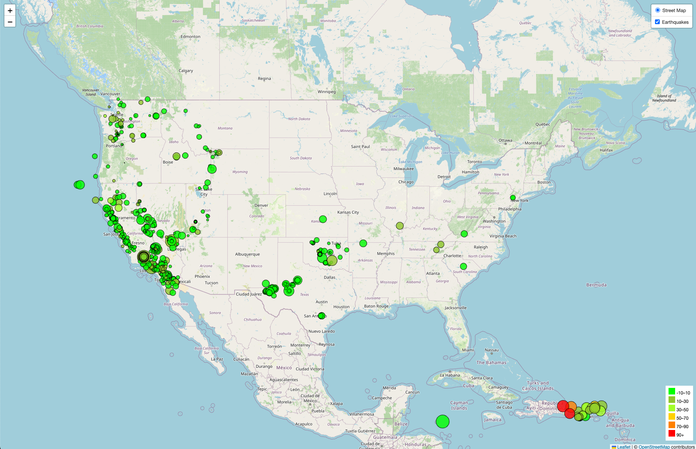

# Earthquake Visualization using Leaflet.js

## Overview

This project is a visualization of recent earthquake data, sourced from the USGS (United States Geological Survey), using Leaflet.js. The map displays earthquake occurrences, their magnitudes, and depths, using different marker sizes and colors.

## Project Structure

### Files

- `part1_index.html`: The main HTML file that structures the webpage.
- `static/js/part1_logic.js`: JavaScript file that handles data fetching, processing, and visualization using Leaflet.js and D3.js.
- `static/css/style.css`: The CSS file that styles the map and the webpage.

### Data Analysis

#### Visualization Features

The map provides the following features:
- **Earthquake Markers**: Markers are sized according to the magnitude of the earthquake and colored based on the depth.
- **Popups**: Each marker has a popup that shows the location and time of the earthquake.
- **Legend**: A legend on the map explains the color coding of the earthquake depths.

### Technologies Used

- **Leaflet.js**: For creating the interactive map.
- **D3.js**: For fetching and processing the GeoJSON data.
- **HTML/CSS**: For structuring and styling the webpage.

## Visualization

The map above visualizes earthquakes from the past 7 days, showing the relationship between magnitude and depth through varying marker sizes and colors.

## Sources

- [USGS Earthquake Data](https://earthquake.usgs.gov/earthquakes/feed/v1.0/summary/all_week.geojson)
- [Leaflet.js Documentation](https://leafletjs.com/)
- [D3.js Documentation](https://d3js.org/)

## How to Use

To view the visualization:
1. Clone the repository.
2. Open `part1_index.html` in a web browser.
3. The map will load and display the earthquake data.

## Acknowledgments

- Data provided by [USGS](https://www.usgs.gov/).
- Project developed as part of a data visualization challenge.
